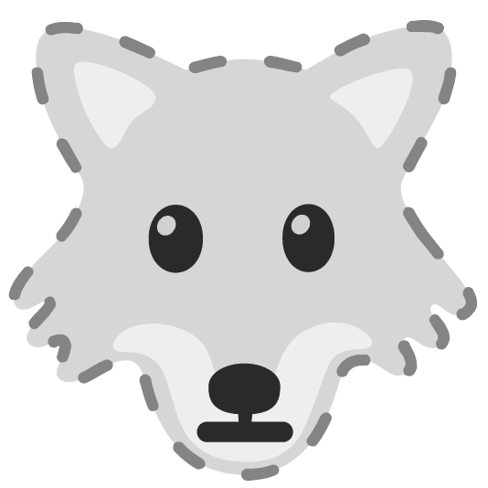

  

   

<table width=100%><tr><td valign="center" width="50%">

 Peruse my [Portfolio](https://tish-sirface-portfolio.netlify.app/)!  
  

  Wanna see my [Resume](https://docs.google.com/document/d/1KrrpczQYqv2uE75S6RF2lGD52rciyn8z5NmygMMA-zk/edit?usp=sharing)?  
  

  Currently developing [TimeCatcher](https://github.com/ThisTish/Time_Catcher)  

  Learning **TypeScript** and **Next.js** right now
  

 Disc golf & sunshine for fun
  

 
   
  
  Fur Family

</td><td valign="end" width="50%">

  

</td></tr></table>  

   

<table style="border: none;"><tr><td valign="top" style="text-align: center; width: 50% ;">

## 🫀 I love coding with... 

  
 

  
 

 
   
  
  
  
  
  
  
  
  
  
  
  

  
  
  

</td><td valign="top"  style="text-align: center; width: 50%;">

## 🦉 I'm ready to learn...  

  
  
  
  
  
  
  
  
  
  
  
  
  
  
  
  
   
  
  
  

</td></tr></table>  

   

 

  

 

  

  

   

<!--START_SECTION:waka-->

<!--END_SECTION:waka-->  
  

   
 

----

Generated using <a href="https://profilinator.rishav.dev/" target="_blank">Github Profilinator</a>
